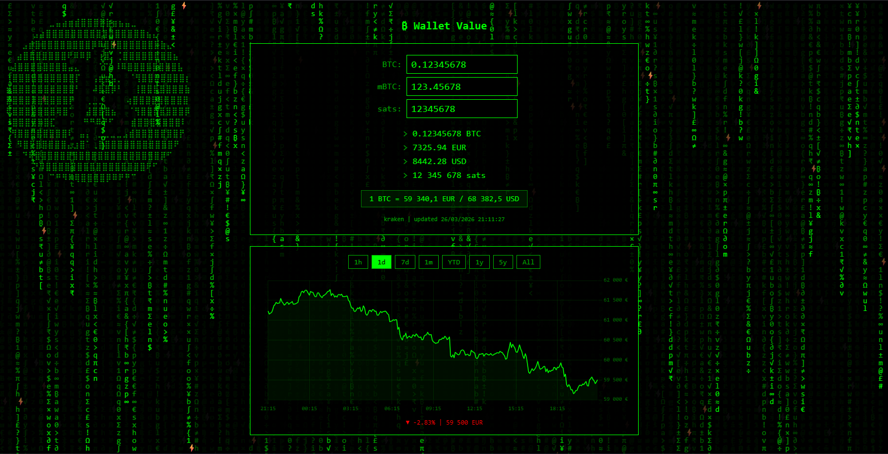

[](https://github.com/deuza/BTC-ticker/commits/main)

[](https://github.com/deuza/BTC-ticker/commits/main)


[](https://creativecommons.org/publicdomain/zero/1.0/)
[](https://www.wtfpl.net/)


[](https://x.com/DeuZa42)

# BTC-ticker
Un front end PHP pour suivre le cours du Bitcoin

# ₿ BTC Wallet Value

> Un tracker de wallet Bitcoin minimaliste, dans l'esthétique terminal qui va bien :)



---

## A quoi ça sert ?

Rentrez le solde de votre wallet (en BTC, mBTC ou sats : ils se synchronisent en temps réel), et la page affiche la correspondance en **EUR** et **USD**, les données sont tiré directement depuis l'API publique de **Kraken**.

- Ticker en temps réel (Kraken `/0/public/Ticker`, rafraîchi toutes les 60s)
- Graphique de prix interactif sur 8 périodes : **1h / 1j / 7j / 1m / YTD / 1an / 5ans / Tout** (endpoint OHLC Kraken)
- Conversion automatique BTC / mBTC / sats à chaque frappe
- Matrix rain en fond, parce que forcément :)
- Zéro tracking, zéro compte, zéro bullshit — JS client-side pur + un bloc de config PHP

---

## Prérequis

- Un serveur web avec **PHP** (n'importe quelle version avec `number_format` et `json_encode` — en gros 7.x)
- Un accès internet pour que le navigateur atteigne l'API Kraken et le CDN Chart.js
- Pas de composer, pas de npm, pas d'étape de build

**Dépendances externes (CDN) :**

| Bibliothèque | Version | Utilisation |
|---|---|---|
| [Chart.js](https://www.chartjs.org/) | ^4 | Graphique d'historique de prix |
| [Kraken REST API](https://docs.kraken.com/rest/) | endpoints publics | Prix en direct + OHLC |

Aucune clé API requise. Tous les endpoints Kraken utilisés sont publics, avec une limite sur les appels API (qui pourraient être mis en cache).
Mais on est largement sous la limite si on ne spam pas les charts.

---

## Installation

```bash
git clone https://github.com/deuza/BTC-ticker.git
cd BTC-ticker
# déposez le tout dans votre webroot ou n'importe quel dossier PHP
```

---

## Configuration

Ouvrez `index.php` et modifiez les deux variables en haut, c'est littéralement tout :

```php
$BTC           = 0.12345678;   // le solde du wallet en BTC
$DEFAULT_CHART = "d";          // la période du graphique par défaut : h|d|w|m|ytd|y|5y|max
```

Tout le reste est calculé à partir de là.

---

## Comment ça marche (tour rapide pour les forkeurs)

```
index.php
├── En-tête PHP    -> calcule mBTC / sats, mappe les labels de période vers les valeurs API
├── HTML/CSS       -> panel + section graphique, canvas matrix, style monospace/terminal
└── JS
    ├── Matrix rain         -> animation canvas, pure vanité assumée
    ├── Sync des inputs     -> conversion live BTC ↔ mBTC ↔ sats
    ├── fetchPrice()        -> API Ticker Kraken, au chargement + toutes les 60s
    ├── loadChart(period)   -> API OHLC Kraken, intervalle auto-adapté selon la période
    └── Boutons du graphe   -> debounce 300ms pour ne pas marteler l'API
```

**Le code est volontairement simple et auto-contenu dans un seul fichier pour être facile à lire, forker et adapter.**

---

## Licences

Ce projet est dual-licencié ! Choisissez ce qui vous arrange :

- **[CC0 1.0 Universel](https://creativecommons.org/publicdomain/zero/1.0/)** — dédicace au domaine public
- **[WTFPL](http://www.wtfpl.net/)** — Do What The Fuck You Want To Public License

Voir `LICENSE-WTFPL` pour le texte complet de la WTFPL.

---

## Crédits

Code initial généré par [Claude](https://claude.ai) (Anthropic) sur la base de spécifications humaines.  
Code audité, modifié et maintenu par [@deuza](https://github.com/deuza).


## Star History

<a href="https://www.star-history.com/?repos=deuza%2FBTC-ticker&type=timeline&legend=top-left">
 <picture>
   <source media="(prefers-color-scheme: dark)" srcset="https://api.star-history.com/image?repos=deuza/BTC-ticker&type=timeline&theme=dark&legend=top-left" />
   <source media="(prefers-color-scheme: light)" srcset="https://api.star-history.com/image?repos=deuza/BTC-ticker&type=timeline&legend=top-left" />
   
 </picture>
</a>

<p align="center">With ❤️ by <a href="https://github.com/deuza">DeuZa</a></p></sup></sub>

